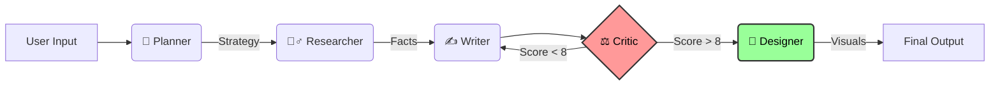
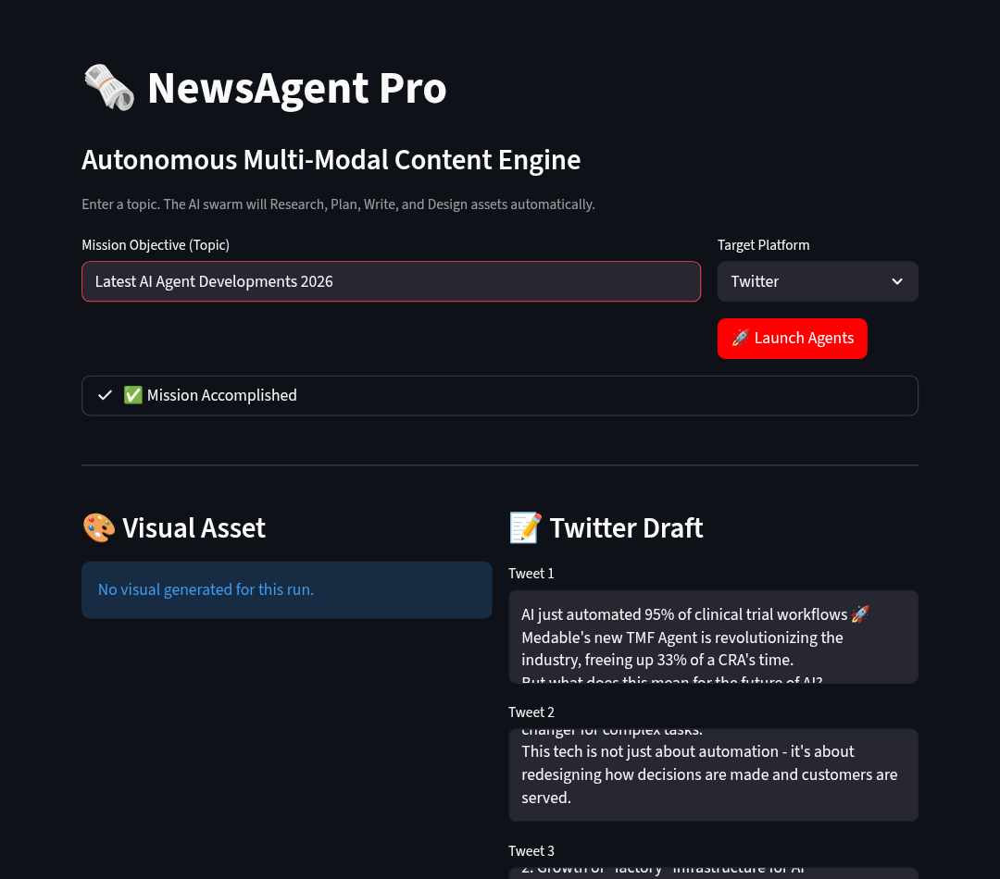
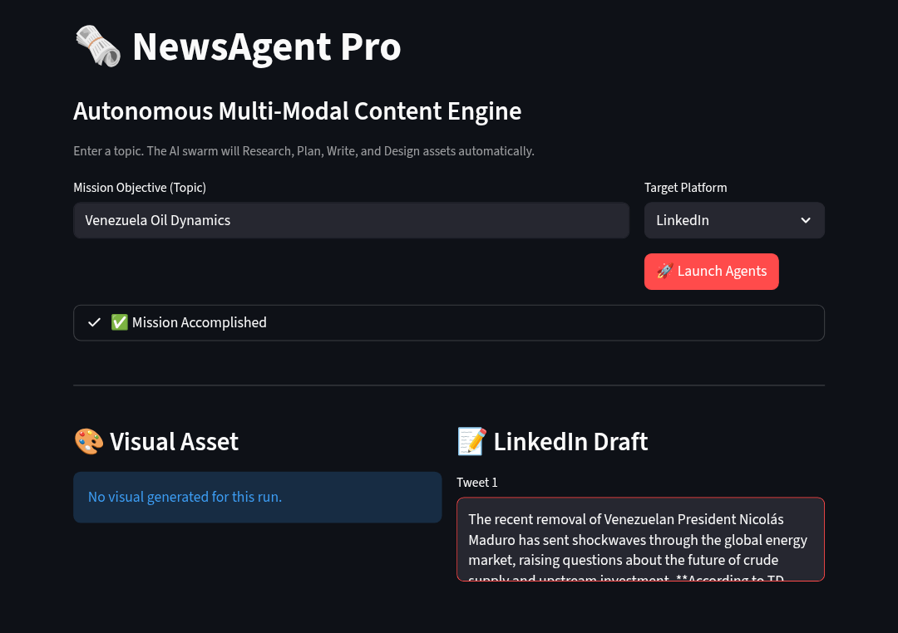

<div align="center">

# 🗞️ NewsAgent Pro v2
### *The Autonomous, Self-Correcting AI Newsroom*

<!-- TECH STACK BADGES -->
<p>
  
  
  
  
  
</p>

<!-- HERO GIF (Clickable) -->
<a href="https://huggingface.co/spaces/EATosin/NewsAgent-Pro">
  
</a>

<br/><br/>

<!-- CALL TO ACTION BUTTONS -->
<p>
  <a href="https://huggingface.co/spaces/EATosin/NewsAgent-Pro">
    
  </a>
  &nbsp;
  <a href="#-system-architecture">
    
  </a>
  &nbsp;
  <a href="#-installation">
    
  </a>
</p>

</div>

---


## ⚡ The Problem: "Content Fatigue"
To run a high-quality media channel today, you need a **Researcher** to find facts, a **Writer** to draft hooks, an **Editor** to fix mistakes, and a **Designer** to make thumbnails.
Doing this manually takes hours. Most "AI Writers" just hallucinate generic slop.

## 🧠 The Solution: Agentic Workflow
**NewsAgent Pro** is not a chatbot. It is a **Multi-Agent Swarm** that mimics a real newsroom.
It reads the internet, plans a strategy, drafts content, **critiques its own work**, and designs branded visuals—all in 60 seconds.

### ✨ Key Innovations (v2.0)
*   **🔄 Self-Correction Loop:** The **Critic Agent** reads the draft and grades it (1-10). If the score is low, it sends it back to the Writer with specific feedback. It iterates until perfection.
*   **⚡ Hyper-Fast Inference:** Powered by **Groq (Llama 3.3)** for sub-second logic and planning.
*   **🕵️‍♂️ Real-Time Truth:** Uses **Tavily API** to scrape live news (last 48 hours), preventing hallucinations.
*   **🎨 AI Graphic Design:** Uses **Flux.1-Schnell** to generate cinematic backgrounds, then uses **Python Pillow** to programmatically overlay "Newsflash" headlines.

---

## ⚙️ System Architecture

The system uses a **Stateful Graph** (LangGraph) with conditional routing.



### The "Newsroom" Staff
| Role | Model / Tool | Function |
| :--- | :--- | :--- |
| **Planner** | **Llama 3.3 (Groq)** | Analyzes the topic and determines the "Viral Angle." |
| **Researcher** | **Tavily API** | Scrapes the web for facts/quotes from the last 48 hours. |
| **Writer** | **Gemini 2.5 / Groq** | Drafts platform-specific content (Threads vs Posts). |
| **Critic** | **Llama 3.3 (Groq)** | **The Gatekeeper.** Rejects low-quality drafts and forces rewrites. |
| **Designer** | **Flux.1-Schnell** | Generates 16:9 cinematic cover art in <4 steps. |

---
## 🖼️ Sample Outputs

<table width="100%">
  <tr>
    <th width="50%">Twitter Thread (Viral Style)</th>
    <th width="50%">LinkedIn Post (Professional)</th>
  </tr>
  <tr>
    <td align="center">
      <b>Topic:</b> "AI Agents 2026"<br>
      
    </td>
    <td align="center">
      <b>Topic:</b> "Venezuela Oil Crisis"<br>
      
    </td>
  </tr>
  <tr>
    <td align="center"><i>Short, punchy, thread-formatted.</i></td>
    <td align="center"><i>Deep dive, strategic analysis.</i></td>
  </tr>
</table>

```
AI agents aren't hype anymore—they're quietly taking over dev workflows in 2026.

(thread 🧵)
|||Groq just dropped free-tier Llama 3.1 70B inference that's faster than most paid APIs.

Sub-100ms latency. No card needed.

This changes everything.
|||LangGraph + critique loops = agents that self-improve until viral-ready.

No more generic slop.
|||Real wins: Teams reporting 40–60% faster prototyping.

The gap between indie hackers and big tech is closing FAST.
|||But risks remain: Hallucinations without strong guardrails.

The best setups route Groq ↔ Gemini for speed + context.
|||2026 prediction: Every company ships internal agent tools.

The ones who master hybrid routing win.
|||I'm building with this exact stack daily.

What's your biggest agent win so far? Reply below 👇

#AI #Agents #Productivity
```
---

## 🚀 Live Demo

**Try the Production Build on Hugging Face Spaces:**

[](https://huggingface.co/spaces/EATosin/NewsAgent-Pro)

> *Try searching: "DeepSeek vs OpenAI" or "SpaceX Starship Launch"*

---

## 📦 Installation (Local & Cloud)

### 1. Clone & Setup
```bash
git clone https://github.com/Eatosin/NewsAgent-Pro.git
cd NewsAgent-Pro
pip install -r requirements.txt
```

### 2. Configure Environment
Create a `.env` file with your keys (Get Groq for free speed!):
```env
GROQ_API_KEY=gsk_...
GEMINI_API_KEY=AIza...
TAVILY_API_KEY=tvly-...
HF_TOKEN=hf_...
```

### 3. Run the App
```bash
streamlit run src/app.py
```

### 4. Docker (Production)
We use a custom multi-stage build to handle system dependencies (Fonts, Pillow):
```bash
docker build -t newsagent .
docker run -p 7860:7860 --env-file .env newsagent
```

---

## 📈 Star History

[](https://star-history.com/#Eatosin/NewsAgent-Pro&Date)

---

## 👨‍💻 Author
**Owadokun Tosin Tobi**
*Senior AI Engineer & Product Builder*

*   **Portfolio:** [GitHub](https://github.com/eatosin)
*   **Connect:** [LinkedIn](https://www.linkedin.com/in/owadokun-tosin-tobi-6159091a3)

---
*Built with the Lexpertz R&D Stack.*
