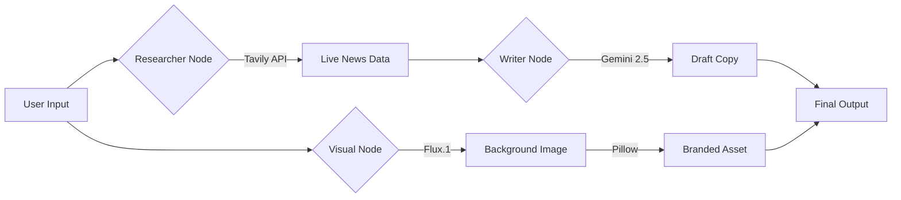

[View Live Demo](https://huggingface.co/spaces/EATosin/NewsAgent-Pro)

<div align="center">

# 🗞️ NewsAgent Pro: Autonomous Content Engine
### *Multi-Modal AI Agent that Researches, Writes, and Designs Viral News.*

[](https://streamlit.io/)
[](https://ai.google.dev/)
[](https://tavily.com/)
[](https://huggingface.co/black-forest-labs/FLUX.1-dev)

[View Live Demo](#-live-demo) • [Architecture](#-system-architecture) • [Setup](#-installation)

</div>

---

## ⚡ The Problem: "The Blank Page"
Content creation is a bottleneck. To post high-quality news updates, a human must:
1.  **Research:** Scrape multiple news sites to find facts.
2.  **Write:** Draft content optimized for different platforms (X vs LinkedIn).
3.  **Design:** Create a visually appealing image to stop the scroll.
4.  **Format:** Ensure character limits aren't breached.

**NewsAgent Pro automates this entire pipeline.**

## 🧠 The Solution: Agentic Workflow
NewsAgent Pro is not a chatbot. It is a **Multi-Modal Agent** that connects live internet data to state-of-the-art generation models.

### Key Capabilities
*   **🕵️‍♂️ Real-Time Research:** Uses **Tavily API** to scrape news from the last 48 hours. It cites sources, ensuring factual accuracy over hallucination.
*   **✍️ Adaptive Copywriting:** Uses **Gemini 2.5 Flash** to write platform-specific content.
    *   *Twitter Mode:* Generates threaded tweets (<280 chars) with hooks.
    *   *LinkedIn Mode:* Generates long-form professional insights.
*   **🎨 AI Graphic Design:** Uses **Flux.1 (via Hugging Face)** to generate cinematic background art, then uses **Python Pillow** to programmatically overlay "Newsflash" style headlines.

---

## ⚙️ System Architecture



---

## 🚀 Installation

### Prerequisites
*   Python 3.10+
*   API Keys: Google Gemini, Tavily, Hugging Face Token.

### Local Setup
```bash
# 1. Clone the repository
git clone https://github.com/eatosin/NewsAgent-Pro.git
cd NewsAgent-Pro

# 2. Install dependencies
pip install -r requirements.txt

# 3. Create .env file
echo "GEMINI_API_KEY=your_key" >> .env
echo "TAVILY_API_KEY=your_key" >> .env
echo "HF_TOKEN=your_key" >> .env

# 4. Run the App
streamlit run app.py
```

### Docker Deployment
The project includes a production-ready `Dockerfile` for deployment on Hugging Face Spaces or Render.

```dockerfile
# Run on port 7860 (Hugging Face Default)
CMD ["streamlit", "run", "app.py", "--server.port=7860", "--server.address=0.0.0.0"]
```

---

## 👨‍💻 Author
**Owadokun Tosin Tobi**
*AI Product Engineer*

*   **Portfolio:** [GitHub](https://github.com/eatosin)
*   **Connect:** [LinkedIn](https://www.linkedin.com/in/owadokun-tosin-tobi-6159091a3?utm_source=share&utm_campaign=share_via&utm_content=profile&utm_medium=android_app)

---
*Powered by the Lexpertz AI Engineering Stack.*
