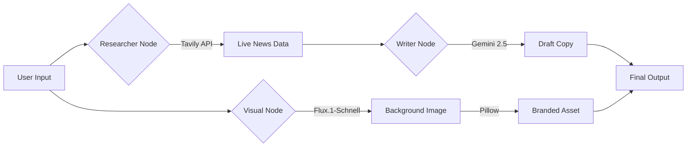

<div align="center">

# 🗞️ NewsAgent Pro: Autonomous Content Engine
### *Multi-Modal AI Agent that Researches, Writes, and Designs Viral News.*

[](https://streamlit.io/)
[](https://ai.google.dev/)
[](https://huggingface.co/black-forest-labs/FLUX.1-schnell)
[]()

[View Live Demo](https://huggingface.co/spaces/EATosin/NewsAgent-Pro) • [Architecture](#-system-architecture)

</div>

---

## ⚡ The Problem: "The Blank Page"
Content creation is a bottleneck. To post high-quality news updates, a human must research, write, and design.
**NewsAgent Pro** automates this entire pipeline into a single click.

## 🧠 The Solution: Agentic Workflow
NewsAgent Pro is a **Multi-Modal Agent** that connects live internet data to state-of-the-art generation models.

### Key Capabilities
*   **🕵️‍♂️ Real-Time Research:** Uses **Tavily API** to scrape news from the last 48 hours.
*   **✍️ Adaptive Copywriting:** Uses **Gemini 2.5 Flash** to write platform-specific content (Twitter Threads vs LinkedIn Posts).
*   **🎨 AI Graphic Design:** Uses **Flux.1-Schnell** (SOTA Latent Diffusion) to generate cinematic background art, then uses **Python Pillow** to programmatically overlay "Newsflash" style headlines.
*   **🛡️ Robust Error Handling:** Self-healing image generation pipeline with explicit error reporting for API quotas.

---

## ⚙️ System Architecture



## 🚀 Installation

### Prerequisites
*   Python 3.10+
*   API Keys: Google Gemini, Tavily, Hugging Face Token.

### Docker Deployment
The project includes a production-ready `Dockerfile` for deployment on Hugging Face Spaces.

```dockerfile
# Run on port 7860 (Hugging Face Default)
CMD ["streamlit", "run", "app.py", "--server.port=7860", "--server.address=0.0.0.0"]
```

---

## 👨‍💻 Author
**Owadokun Tosin Tobi**
*AI Product Engineer*